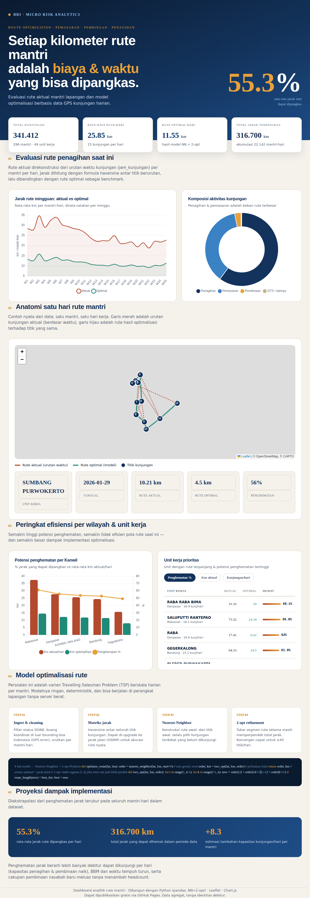

# Route Optimization — Evaluasi & Optimalisasi Rute Mantri

Dashboard analitik untuk mengevaluasi rute **pemasaran, pembinaan, dan penagihan** mantri lapangan, sekaligus model optimalisasi rute berbasis data GPS kunjungan harian.

**Hasil utama dari data:** rata-rata jarak rute mantri dapat dipangkas **~55%** (dari 25,9 km → 11,6 km per mantri-hari), setara akumulasi **316.700 km** sepanjang periode data — tanpa mengurangi jumlah kunjungan. Basis data: 341.412 kunjungan, 296 mantri, 49 unit kerja, 5 Kanwil (Jan–Jun 2026).



---

## Apa isi repo ini

```
route-opt/
├── docs/                     # Dashboard web (di-publish via GitHub Pages)
│   ├── index.html            # Dashboard interaktif, self-contained
│   ├── data.json             # Data agregat hasil analisis
│   └── vendor/               # Chart.js + Leaflet (lokal, tanpa CDN)
├── src/
│   └── route_optimizer.py    # Pipeline analisis + model optimalisasi
├── data/
│   ├── Route_Optimization_2.xlsx     # Data sumber kunjungan (terbaru)
│   └── route_days_summary.csv        # Hasil agregat per mantri-hari
├── requirements.txt
└── .github/workflows/deploy.yml      # Auto-deploy ke GitHub Pages
```

---

## Metodologi

**1. Evaluasi rute aktual.** Untuk setiap mantri pada setiap hari, kunjungan diurutkan berdasarkan `jam_kunjungan`. Jarak tempuh dihitung dengan formula **haversine** antar titik berurutan. Koordinat di luar bounding-box Indonesia (GPS error) dan hari dengan jarak tidak masuk akal (>500 km) dibuang.

**2. Model optimalisasi.** Persoalan ini adalah varian **Travelling Salesman Problem (TSP)** berskala harian per mantri:

| Tahap | Metode |
|---|---|
| Konstruksi rute awal | **Nearest-Neighbor** — selalu pilih kunjungan terdekat berikutnya |
| Perbaikan lokal | **2-opt** — balik segmen rute selama total jarak masih berkurang |

Model ini ringan dan deterministik (konvergen cepat untuk ≤40 titik/hari), sehingga bisa berjalan di perangkat lapangan tanpa server berat. Untuk akurasi jarak jalan sebenarnya, matriks jarak haversine dapat di-upgrade ke **OSRM/Google Distance Matrix**.

**3. Benchmark penghematan.** Jarak rute aktual dibandingkan dengan rute optimal pada titik kunjungan yang sama, menghasilkan % penghematan per mantri-hari, per unit kerja, dan per Kanwil.

---

## Menjalankan analisis ulang

```bash
pip install -r requirements.txt
python src/route_optimizer.py --input data/Route_Optimization_2.xlsx --out docs/data.json
```

Output `docs/data.json` otomatis dipakai oleh `docs/index.html`.

---

## Publish dashboard GRATIS via internet

Dashboard adalah file statis, jadi bisa di-hosting gratis. Pilih salah satu:

### Opsi A — GitHub Pages (rekomendasi, otomatis)

1. Buat repo baru di GitHub, push folder ini:
   ```bash
   git init && git add . && git commit -m "Route optimization dashboard"
   git branch -M main
   git remote add origin https://github.com/<username>/route-opt.git
   git push -u origin main
   ```
2. Di GitHub: **Settings → Pages → Source: GitHub Actions**.
3. Workflow `.github/workflows/deploy.yml` otomatis men-deploy folder `docs/`.
4. Dashboard live di: `https://<username>.github.io/route-opt/`

> Alternatif tanpa Actions: **Settings → Pages → Source: Deploy from a branch → main → /docs**.

### Opsi B — Netlify (drag & drop)

1. Buka [app.netlify.com/drop](https://app.netlify.com/drop)
2. Seret folder `docs/` ke halaman tersebut → langsung dapat URL publik.

### Opsi C — Cloudflare Pages

1. **Workers & Pages → Create → Pages → Connect to Git**, pilih repo ini.
2. Build command: kosongkan. Output directory: `docs`.

---

## Dashboard rekomendasi rute (Streamlit)

Folder `streamlit/` berisi aplikasi web interaktif untuk **merekomendasikan urutan rute kunjungan harian mantri**. Unggah daftar titik debitur (NIK, Nama, tipe, longitude, latitude) dan aplikasi mengembalikan urutan optimal + peta interaktif + estimasi penghematan jarak.

```bash
cd streamlit
pip install -r requirements.txt
streamlit run app.py
```

Deploy gratis ke **[share.streamlit.io](https://share.streamlit.io)** dengan main file path `streamlit/app.py`. Detail lengkap di `streamlit/README.md`.

---

## Catatan privasi

Dashboard hanya menampilkan **data agregat** (jarak, jumlah kunjungan, unit kerja). Tidak ada identitas debitur, nomor pinjaman, atau PN mantri yang dipublikasikan. Sebelum hosting publik, pastikan kebijakan data internal terpenuhi.
